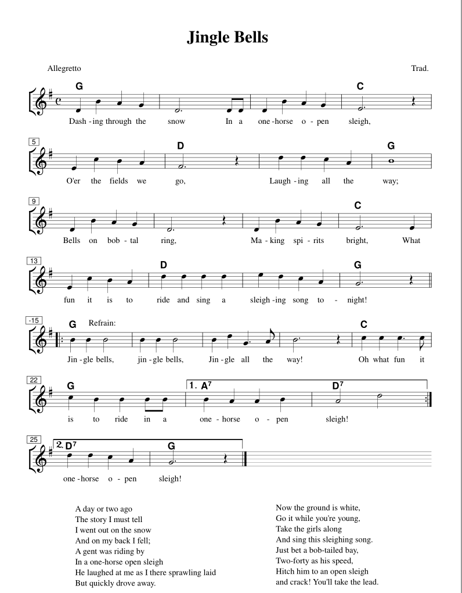

# De muziek van *Jingle bells*

Zo ziet de muziek en tekst van *Jingle bells* er uit:

Zo, dat zijn een hoop noten! Daarom hoef je ze niet zelf te programmeren, maar geven we je de noten kant-en-klaar. Dan kun jij je bezig houden met interessantere programmeertaken.

[De volgende stap >>](stap_2.md)

 Dit werk valt onder een <a rel="license" href="http://creativecommons.org/licenses/by-nc-sa/4.0/deed.nl">Creative Commons Naamsvermelding-NietCommercieel-GelijkDelen 4.0 Internationaal-licentie</a>.
